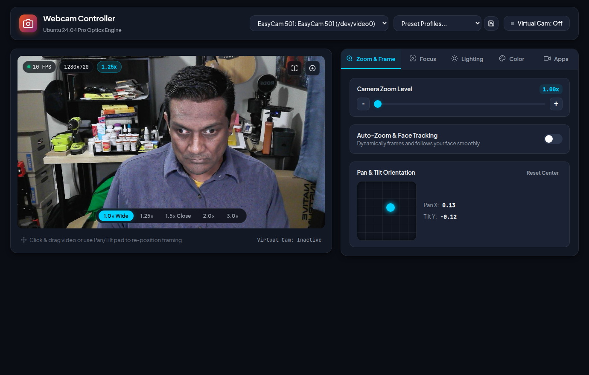
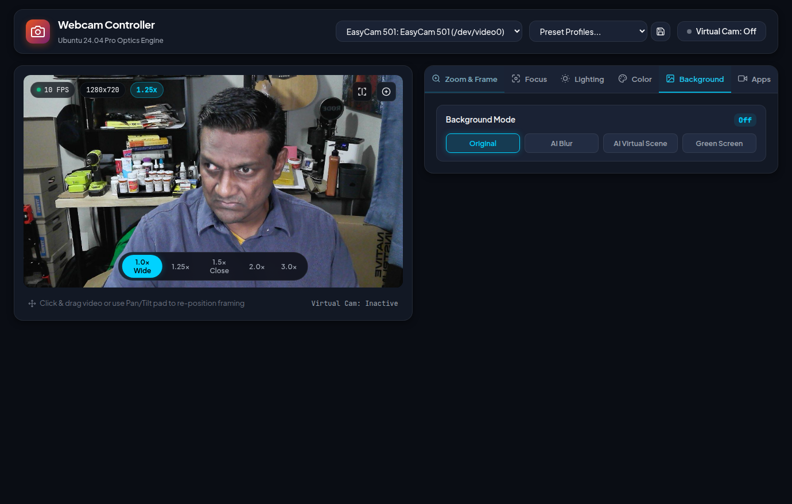
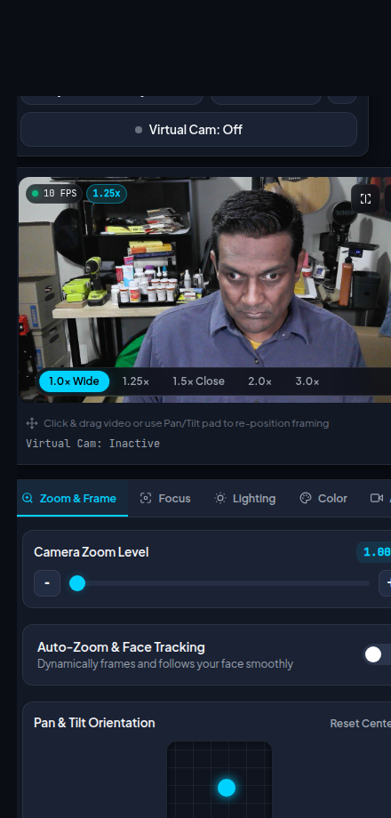
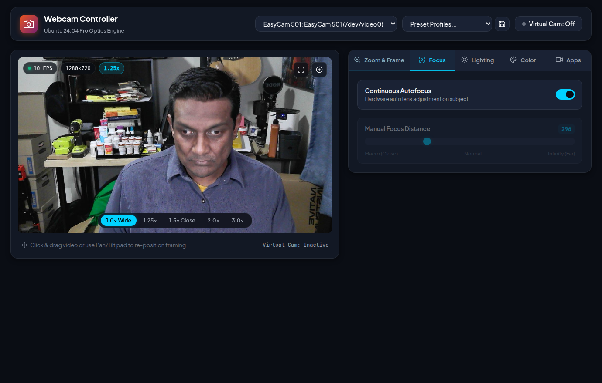
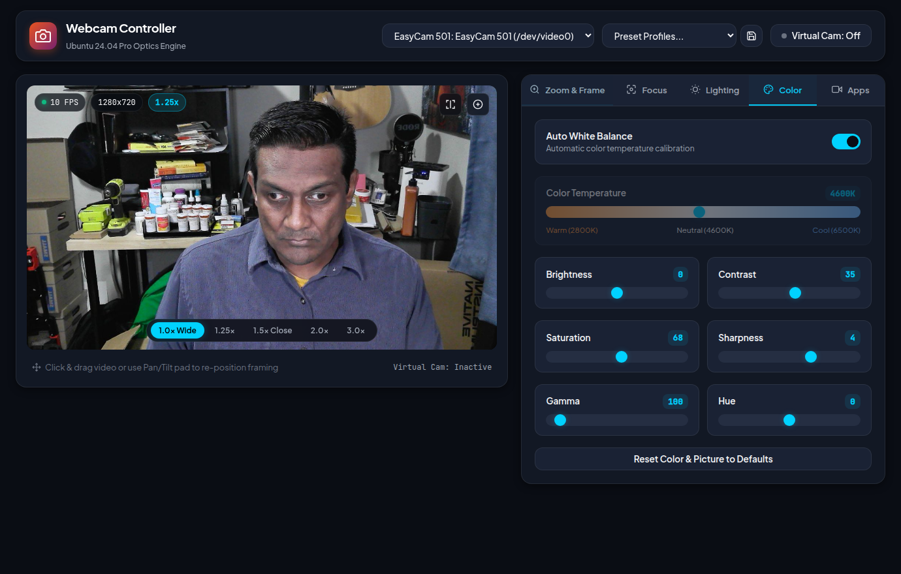

# 🎥 Linux Webcam Controller (Ubuntu 24.04)

A modern, high-precision webcam controller and optics manager designed for Ubuntu 24.04. It brings advanced camera zoom, auto-framing face tracking, autofocus / manual focus, lighting, color grading, **AI virtual backgrounds, bokeh background blur, and green screen chroma keying** to applications that lack fine camera controls—such as **Microsoft Teams, Zoom, Google Meet, OBS Studio, and Web Browsers**.

---

## 📸 Screenshots

### Desktop View (Main Interface & Zoom Controls)


### Virtual Backgrounds, Blur & Green Screen (Chroma Key)


### Mobile & Narrow Browser Width (Responsive Design)
<p align="center">
  
</p>

### Focus & Optics Controls


### Color & Lighting Calibration


---

## ✨ Features

- 🖼️ **Virtual Backgrounds & Blurring (AI & Chroma Key)**:
  - **AI Background Blur (Bokeh)**: Realistic depth-of-field background blurring with adjustable intensity slider (5px to 51px).
  - **AI Virtual Scenes (No Screen Needed)**: Ultra-fast Google MediaPipe Selfie Segmentation running via LiteRT XNNPACK (under 3ms on CPU).
  - **Curated Background Presets**: *Executive Office*, *Warm Library*, *Modern Studio Loft*, *Cyberpunk Neon*, *Sunset Gradient*.
  - **Custom Image Upload**: Upload and apply any custom `.jpg`, `.png`, or `.webp` photo from your computer.
  - **Physical Green / Blue Screen (Chroma Key)**: Professional chroma keying engine with Key Color Picker (Green `#00FF00`, Blue `#0047BB`, or Custom Sample), Tolerance slider, Edge Smoothness/Feathering, and Spill Suppression to eliminate green reflection halos on subject edges.
- 🔍 **Camera Zoom**:
  - **Manual Digital Zoom**: 1.0x to 5.0x smooth cubic interpolation.
  - **Pan & Tilt**: 2D interactive joystick pad and direct drag-to-pan on the video viewport.
  - **Quick Zoom Presets**: 1-click `1.0x (Wide)`, `1.25x`, `1.5x (Close-up)`, `2.0x`, `3.0x`.
  - **Hardware Zoom**: Automatically synchronizes with hardware `zoom_absolute` if supported by the camera firmware.
- 🎯 **Auto-Zoom & Smart Face Tracking**:
  - Automatically detects your face and smoothly zooms and centers your video feed with cinematic damping (anti-jitter).
  - Configurable tracking speed and framing headroom.
- 🔬 **Focus Optics**:
  - Continuous Autofocus (`focus_automatic_continuous`) toggle.
  - Fine-grained Manual Focus slider (`focus_absolute`) with distance presets (Macro, Normal, Infinity).
- 💡 **Lighting & Exposure**:
  - Auto-Exposure mode toggle vs Manual Shutter/Exposure time slider (`exposure_time_absolute`).
  - Backlight Compensation (`backlight_compensation`).
  - Sensor Gain boost (`gain`).
- 🎨 **Color & Picture Calibration**:
  - Auto White Balance toggle vs manual Color Temperature slider (`white_balance_temperature`: 2800K Warm to 6500K Cool).
  - Brightness, Contrast, Saturation, Hue, Gamma, and Sharpness controls.
  - One-click Factory Defaults Reset.
- 📱 **Responsive & Narrow Window Ready**:
  - Fully responsive layout that adapts gracefully when you narrow your desktop browser window or use split-screen windows.
- 📹 **Virtual Camera Pipeline (MS Teams / Zoom / Meet / Chrome)**:
  - Streams your zoomed, background-replaced, and color-graded video to a Linux virtual webcam device (`/dev/video10` labeled *"Webcam Controller Virtual Cam"*).
  - Simply pick the virtual camera in any conferencing app or browser.
- 💾 **Profile Presets**:
  - Save, load, and switch custom camera profiles (`Meeting Close-up`, `Smart Face Track`, `Low Light Boost`, `Wide Angle`, etc.).

---

## 🚀 Quick Start

### 1. Launch the Application
Run the launcher script:
```bash
./start.sh
```
This automatically sets up the Python virtual environment and opens the controller in your default browser at `http://127.0.0.1:8765`.

### 2. Enable Virtual Camera for Zoom / MS Teams / Browsers (One-Time Setup)
To stream your zoomed feed directly into Zoom or MS Teams as a virtual webcam:
```bash
sudo ./setup_loopback.sh
```
This configures `v4l2loopback` with `/dev/video10` as *"Webcam Controller Virtual Cam"* and enables automatic loading on system boot.

---

## 💻 Architecture

- **Backend**: Python 3.12, FastAPI, Uvicorn, OpenCV (v4.14), LiteRT XNNPACK (MediaPipe Selfie Segmentation), V4L2 IOCTL / `v4l2-ctl` wrapper.
- **Frontend**: Vanilla HTML5, CSS3 Glassmorphism (Ubuntu/GNOME dark aesthetic), WebSockets for real-time bidirectional telemetry.
- **Loopback Pipeline**: High-speed frame processing and YUYV buffer stream directly to `v4l2loopback`.
